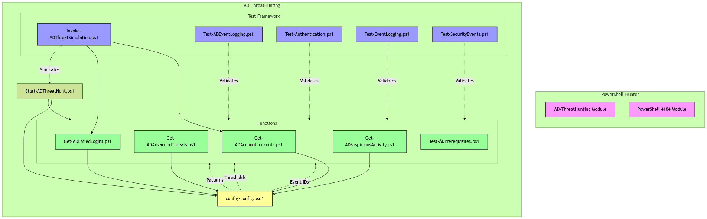

# 🎯 AD Threat Hunting Tool

A PowerShell-based tool for detecting suspicious activities in Active Directory environments.




<p align="center">
  <br>
  <em>Hunt smarter, hunt harder</em>
</p>


## 🔍 Key Features

- 🚨 **Real-time Detection** of:
  - Password Spray Attacks
  - Brute Force Attempts
  - Account Lockouts
  - Suspicious Authentication Patterns

- ⚡ **Smart Analysis**:
  - Timing-based Attack Detection
  - Pattern Recognition
  - Activity Correlation
  - User Behavior Analysis

- 📊 **Comprehensive Reporting**:
  - Detailed Event Timelines
  - Attack Pattern Visualization
  - Activity Summaries
  - Export Options (CSV, JSON, HTML)

## 🛠️ Prerequisites

- Windows Server with AD Domain Services
- PowerShell 5.1 or higher
- Domain Admin privileges
- WinRM or RPC access to Domain Controllers

## 📋 Usage

### Basic Threat Hunt
```powershell
.\Start-ADThreatHunt.ps1 -Hours 24 -UseWinRM
```
NOTE: I did not test RPC, WinRM does work. Please halp.

### Advanced Options
```powershell
# Hunt last 48 hours with specific user focus
.\Start-ADThreatHunt.ps1 -Hours 48 -Identity "username" -UseWinRM

# Export results to CSV
.\Start-ADThreatHunt.ps1 -Hours 24 -ExportPath "C:\Reports" -ExportFormat CSV
```

## 🧪 Testing & Simulation

The tool includes a test framework for simulating various attack scenarios:

```powershell
# Simulate password spray
.\test\Invoke-ADThreatSimulation.ps1 -PasswordSpray

# Simulate brute force against specific user
.\test\Invoke-ADThreatSimulation.ps1 -BruteForce -TargetUser "administrator" -EventCount 15

# Simulate account lockout
.\test\Invoke-ADThreatSimulation.ps1 -AccountLockout -TargetUser "testuser"

# Generate random attack patterns
.\test\Invoke-ADThreatSimulation.ps1 -Random -Verbose
```

## 📈 Understanding Results

The tool analyzes several key indicators:

### 1. Timing Analysis 🕒
- Attack duration and intensity
- Attempts per minute
- High activity time windows
- Pattern correlation

### 2. Attack Patterns 🎯
- Password Sprays: Multiple accounts, same password
- Brute Force: Single account, multiple passwords
- Mixed Attacks: Random patterns and combinations

### 3. Event Types 📝
- Failed login attempts (Event ID 4625)
- Account lockouts (Event ID 4740)
- Authentication patterns
- Logon type distribution

## 🔄 How It Works

1. **Collection**: Gathers security events from Domain Controllers
2. **Analysis**: 
   - Groups events by time windows
   - Identifies attack patterns
   - Calculates activity metrics
3. **Detection**:
   - High-frequency attempts
   - Suspicious timing patterns
   - Known attack signatures
4. **Reporting**:
   - Detailed summaries
   - Visual indicators
   - Actionable insights

## 🚀 Best Practices

1. Run regularly as part of security monitoring
2. Use appropriate time windows (-Hours parameter)
3. Export results for long-term analysis
4. Combine with other security tools
5. Test in lab environment first

## ⚠️ Notes

- Use in production environments with caution
- Monitor resource usage on large domains
- Consider network impact when using WinRM
- Review audit policies for proper logging